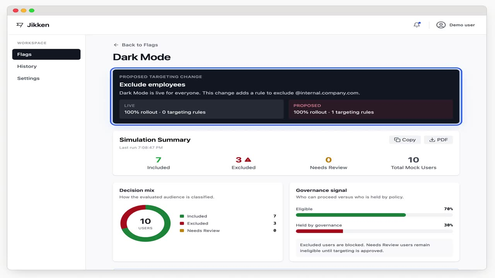
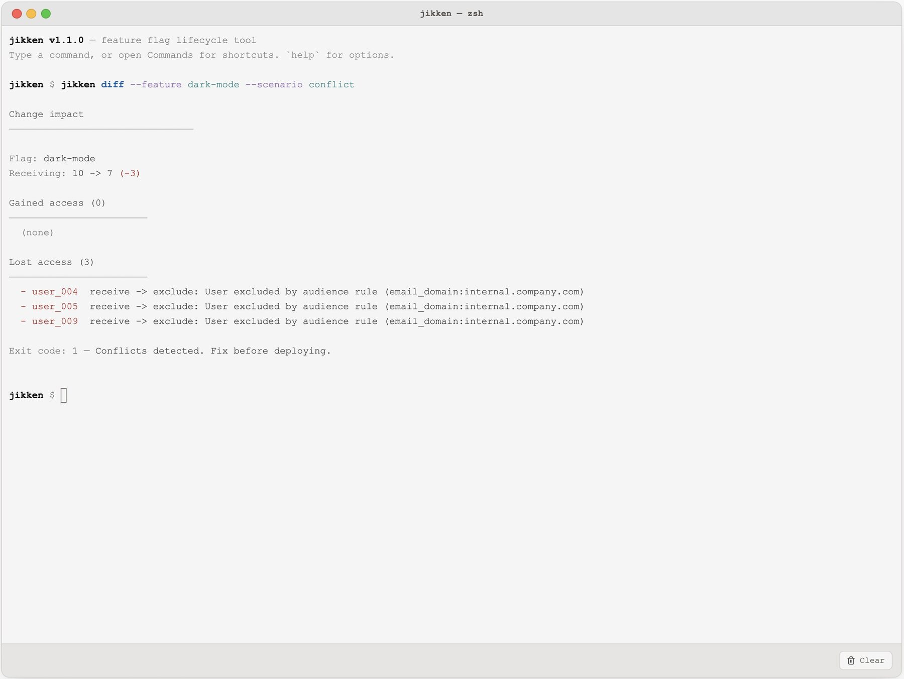
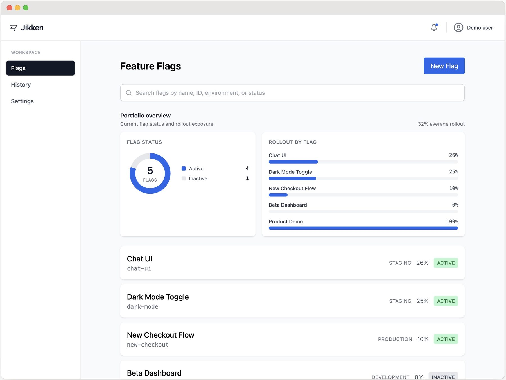
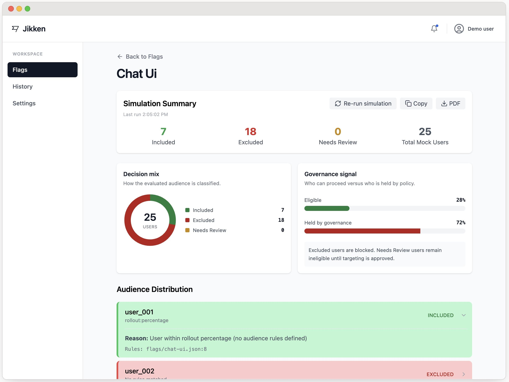
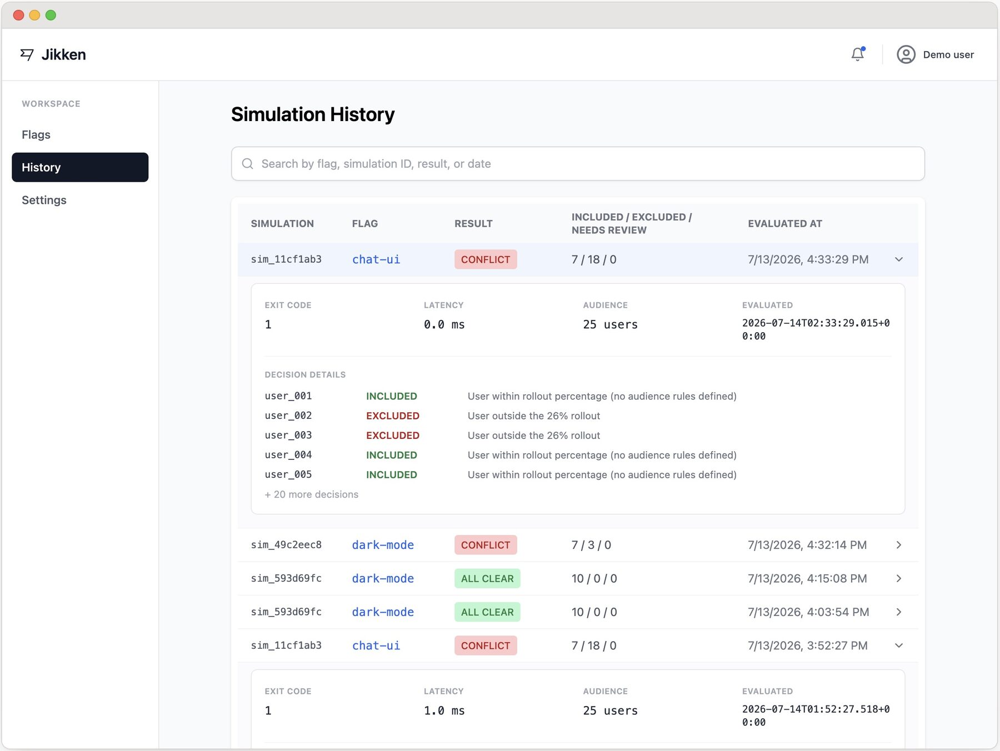
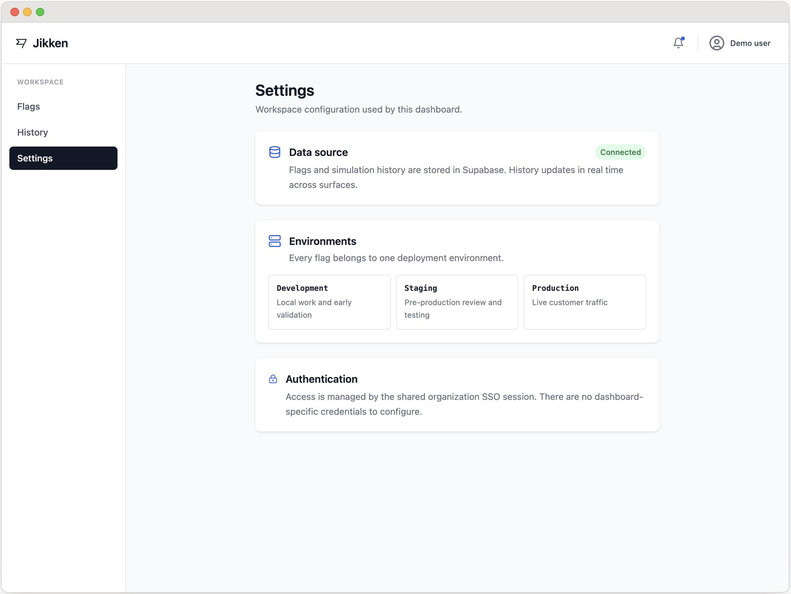
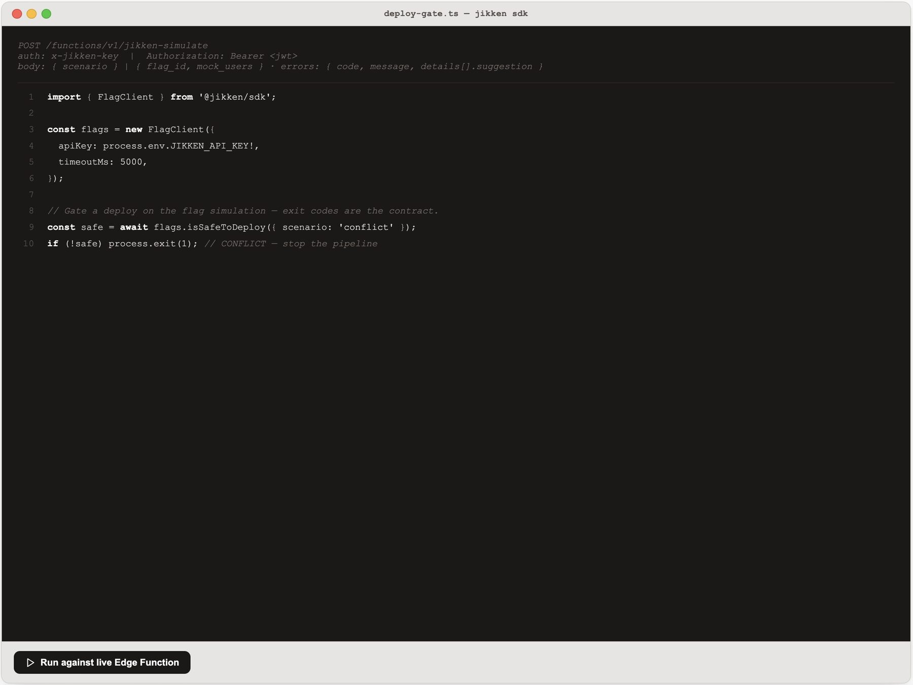
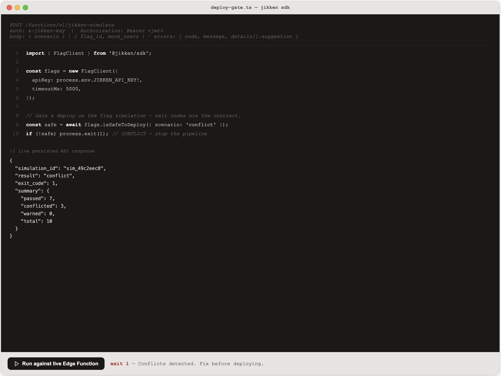
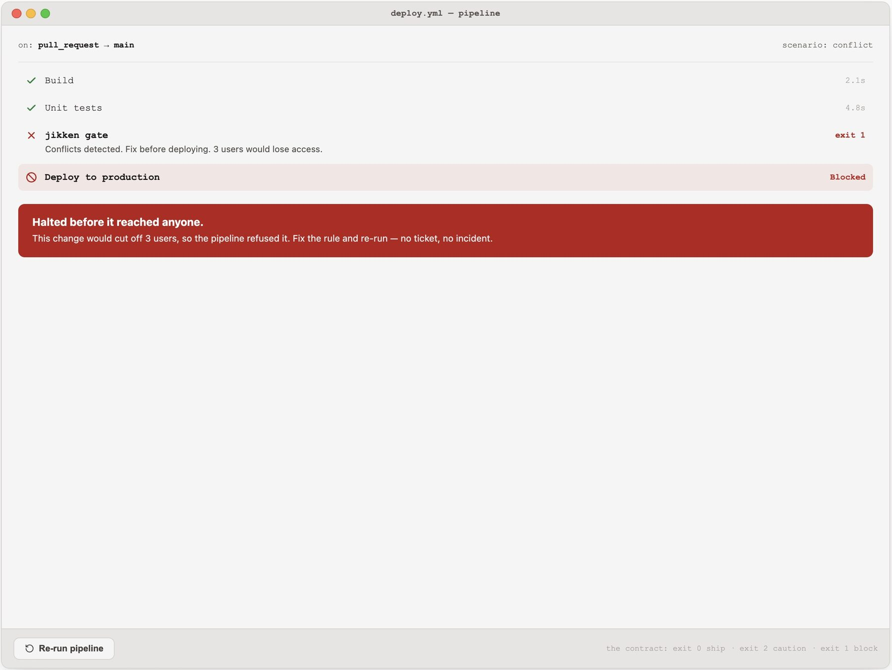

# Jikken

[](https://github.com/RHI-Org/jikken/actions/workflows/flag-validation.yml)

Govern feature-flag changes across CLI, Dashboard, SDK, and CI—preview audience impact, preserve explainable decisions, and block risky rollouts.

## Watch the product walkthrough

See one targeting decision move through the CLI, Dashboard, SDK, and CI gate in this narrated 83-second walkthrough.

[](https://jk.experienceplus.ai/walkthrough)

[▶ Watch the walkthrough](https://jk.experienceplus.ai/walkthrough)

**Current release: v1.1.0** — an iteration driven by explicitly labeled AI-simulated UX research and followed by full automated verification.

**Jikken** is Japanese for **experiment**. The name reflects the app's purpose: test a proposed feature-flag change against a representative audience before it reaches production. Jikken turns that experiment into a governed decision by showing who gains access, who is excluded, and which changes need review—then carries the same verdict into the CLI, Dashboard, SDK, and CI gate.

Developer tooling can keep one coherent design language across every surface it touches. Green means "receives the flag" everywhere. Red means "excluded" everywhere. Yellow means "needs review" everywhere. The field is spelled `rollout_percentage` on every surface. Exit code 1 means the same conflict in the CLI, Dashboard, SDK, and CI gate. The hard part is not building one good interface — it is building four that feel like they came from the same mind.

### A governance lifecycle

Jikken applies a **governance lifecycle** to feature flags: a policy is decided once, then evaluated and enforced coherently across the people who configure it, the engineers who call it, and the pipelines that gate on it—with a **decision** (`allow` / `hold` / `needs-review`), a **reason**, and a **tamper-evident audit trail** at every surface. The same architecture extends to access control, data validation, and **agent tool-use policy**. When code is cheap, governance is the scarce resource: the same decision must remain legible and enforceable everywhere it is read.

## Four surfaces, one mind

| Surface | Audience | Tech Stack | Key Features |
| :--- | :--- | :--- | :--- |
| CLI (`jikken`) | Engineers | Commander.js | `simulate`, `validate`, `diff` commands |
| Dashboard | Product Managers | React, Vite, Tailwind | Flag editor, simulation tree, live history |
| SDK (`@jikken/sdk`) | Integrations | TypeScript | `FlagClient`, `FlagApiError` with suggestions |
| CI gate | Delivery teams | GitHub Actions | Shared exit-code contract that blocks unsafe deploys |

## Product walkthrough

The flow starts with a developer checking a proposed targeting change and ends with the same decision enforced in CI.

### 1. Catch the conflict in the CLI

The diff identifies exactly which users would lose access and returns exit code 1.



### 2. Review the flag portfolio

The Dashboard summarizes flag status and rollout exposure before a reviewer opens a specific flag.



### 3. Inspect audience impact

The flag detail view translates the result into decision counts, governance signals, audience provenance, and per-user reasoning.



### 4. Preserve the audit trail

Simulation History keeps every verdict searchable and expands each run to show metadata and decision details.



### 5. Verify workspace configuration

Settings makes the active data source, deployment environments, and shared authentication model explicit.



### 6. Use the same contract from the SDK

The SDK asks the same safety question in application code and maps the result directly to process behavior.



### 7. Inspect the machine response

The live response exposes the same simulation ID, conflict verdict, exit code, and audience summary without requiring automation to parse presentation text.



### 8. Enforce the decision in CI

The CI gate consumes exit code 1, blocks production, and prevents the risky change from reaching users.



## The thesis is executable
The `tests/integration/coherence.test.ts` suite enforces design consistency through code:

1. **Color parity**: Canonical hex codes in shared constants must match the Tailwind palette values used in the Dashboard.
2. **Exit-code parity**: The CLI process exit code and JSON output must equal the in-process engine result for the same scenario.
3. **Vendor drift**: Edge Function engine copies must be byte-identical to `shared/src`.
4. **Terminology parity**: `rollout_percentage` must be spelled identically across all surfaces; variant spellings fail the build.

## One engine, three runtimes
`shared/src/engine.ts` is a pure, dependency-free, seeded TypeScript engine. It runs identically in three environments:
- **The browser**: Executed directly by the presentation's CLI tab.
- **Node**: Executed by the installed `jikken` CLI.
- **Supabase Edge Function**: Handles POST requests for the SDK and CI.

The engine does not read clocks, randomness, or environment variables for decisions. Same inputs produce bit-identical decisions and exit codes everywhere. Three deterministic scenarios (`all-clear`, `conflict`, `warning`) evaluate the same seeded user population to ensure cross-surface consistency.

## Exit codes
Defined in `shared/src/constants.ts`.

| Code | Constant | Meaning |
| :--- | :--- | :--- |
| 0 | `ALL_CLEAR` | All checks passed |
| 1 | `CONFLICT` | Rule conflicts detected, stop deployment |
| 2 | `WARNING` | Non-blocking issues, proceed with caution |
| 3 | `INVALID_INPUT` | Bad request, fix and retry |
| 4 | `CONNECTION_FAILURE` | API unreachable, retryable |
| 5 | `DEPRECATED` | Flag uses a deprecated config pattern |
| 6 | `QUOTA_EXCEEDED` | Rate limit hit |

## API contract

The SDK and CI surface the same evaluation over one HTTP endpoint. The contract is designed to be **discoverable from an error** — every failure names the field at fault and how to fix it, so a caller can recover without reading these docs.

**Endpoint** — `POST /functions/v1/jikken-simulate` (Supabase Edge Function; the same seeded engine as the CLI).

**Auth (dual, by caller type)** — a machine key header `x-jikken-key: <key>` for CI/SDK, *or* a Supabase user JWT in `Authorization: Bearer <token>` for browser callers. The key is checked in constant time.

**Request**

```jsonc
// Either a registered flag…            …or a named scenario:
{ "flag_id": "dark-mode",               { "scenario": "conflict" }
  "mock_users": [ /* ≤ 500 */ ],
  "surface": "sdk" }                     // surface is optional, for the audit row
```

**Success — `200`** returns the `SimulationResult`: the machine-readable verdict is `exit_code` (the table above); humans read `summary` and the per-user `decisions[]`. `simulation_id` is a hash of the inputs, so identical requests are provably identical across surfaces.

```jsonc
{ "flag_id": "dark-mode", "simulation_id": "sim_49c2eec8",
  "result": "conflict", "exit_code": 1,
  "summary": { "passed": 7, "conflicted": 3, "warned": 0, "total": 10 },
  "decisions": [ { "user_id": "user_004", "decision": "exclude",
                   "reason": "User excluded by audience rule (…)",
                   "rule_sources": ["flags/dark-mode.json:14"] } ] }
```

**Error — `4xx/5xx`** returns a uniform, teachable shape (never a bare string): a stable `code`, a human `message`, and `details[]` each carrying the offending `field` and a concrete `suggestion`.

```jsonc
{ "error": { "code": "FLAG_NOT_FOUND", "message": "Flag 'dark-mode' is not registered",
             "details": [ { "field": "flag_id", "suggestion": "Check that the flag is registered" } ] } }
```

**Client ergonomics** — `@jikken/sdk`'s `FlagClient` wraps this: `simulate()` throws a typed `FlagApiError` exposing `getFirstSuggestion()`, `isRetryable()`, and `getRetryDelay(attempt)` (exponential backoff, capped at 10s); a request aborts after `timeoutMs`. `isSafeToDeploy()` collapses the whole result to one boolean for a pipeline gate — the API meets the caller at the altitude they need.

## Quick start
Node 20+ required.

```bash
npm install
npm run cli -- simulate --scenario conflict     # exits 1: conflicts detected
npm run cli -- simulate --flag dark-mode --rollout 25
npm run dashboard                               # dashboard dev server
npm run present                                 # presentation shell dev server
npm test                                        # unit suites, every workspace
npm run test:integration                        # the coherence suite
```

## Repository layout
```text
jikken/
├── shared/          # the authority — types, constants, seeded engine, scenarios
├── cli/             # `jikken` binary — Commander.js, exit codes 0–6
├── dashboard/       # React/Vite/Tailwind — five pages
├── sdk/             # @jikken/sdk — FlagClient + FlagApiError
├── presentation/    # guided product shell with a live terminal (xterm.js)
├── docs/            # product walkthrough images and planning documents
├── supabase/        # Edge Function (simulate) + migrations
├── flags/           # sample flag JSON
├── data/            # seeded mock users
└── tests/integration/  # cross-surface coherence tests
```

## Live product
https://jk.experienceplus.ai
A guided product walkthrough with the real CLI running in the browser and the real Dashboard mounted beside it. Ten clickable design principles connect the rationale to the exact product interactions that implement it. Sign-in required.

## CI as a consumer
`.github/workflows/flag-validation.yml` runs all unit and coherence suites. The pipeline's pass/fail status is determined by the CLI's own exit code, run against the shared engine.

## How this was built
This project used an AI-native workflow: a written [product spec](docs/planning/2026-07-12-spec) led to an [implementation plan and design review](docs/planning/IMPLEMENTATION_PLAN.md). Claude Code acted as architect, delegating boilerplate to a smaller open model via `scripts/gemma.mjs`. Every delegated artifact was reviewed and typechecked before integration. Total time from spec to deployed product was roughly one working day.

The workflow was not “AI generated it, therefore it shipped.” Intent was specified first, implementation was delegated across Claude Code, Codex, and Gemma, and every result was evaluated against the running interaction and shared contract. Model output was rejected or revised when it invented the wrong tutorial protocol, allowed early command injection to disappear before the terminal mounted, or used internal scenario names that conflicted with user-facing menu language. Human judgment set the product direction; tests, builds, and direct walkthrough checks determined what was accepted.

The repository also includes [AI-simulated synthetic UX research](docs/research/AI_SIMULATED_UX_RESEARCH.md) using product, platform-engineering, security, and hiring-reviewer personas. It is explicitly a hypothesis-generating cognitive walkthrough—not real-user research—and includes a prioritized list of possible fixes plus a plan for human validation.

## What changed in v1.1

- A persistent run-context strip proves which feature, scenario, environment, verdict, simulation ID, and result source are moving across all four surfaces.
- Feature and scenario selection now prepares shared context; an explicit Run action executes the CLI diff without surprising navigation.
- The Dashboard identifies audience provenance and supports a review lifecycle with actor, policy version, rationale, approval or denial, and a contextual access check.
- The recommended first run is clearer, narrow-screen navigation behaves as a drawer, and the walkthrough labels its research-driven additions as AI-simulated hypotheses—not real-user validation.
- Security constraints appear in the workflow, and the project record shows where human evaluation corrected AI-generated implementation.

## Design principles
Ten principles guide the UX: scannable in 3 seconds; colors functional, not decorative; exit codes are the real product; suggestions beat diagnoses; consistency is the hardest feature; transparent reasoning; explicit role division; intentional restraint; validate before you compute; graceful failure is a feature.
